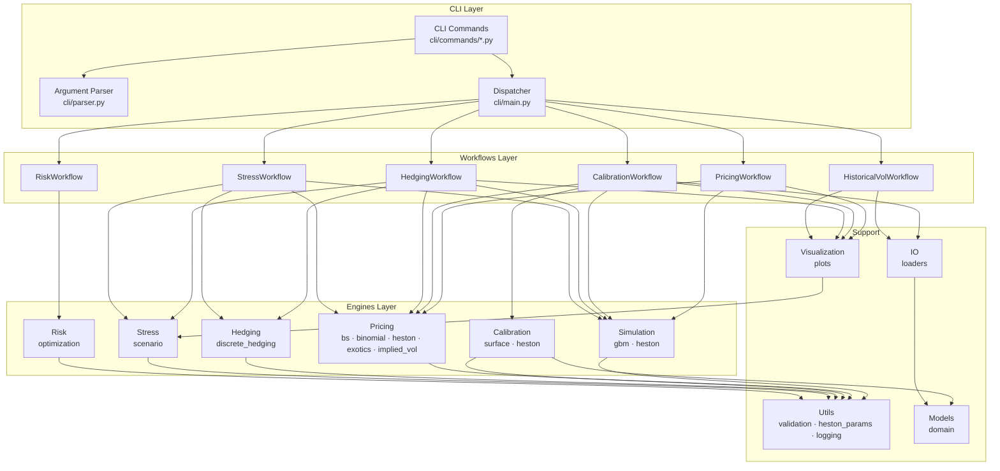
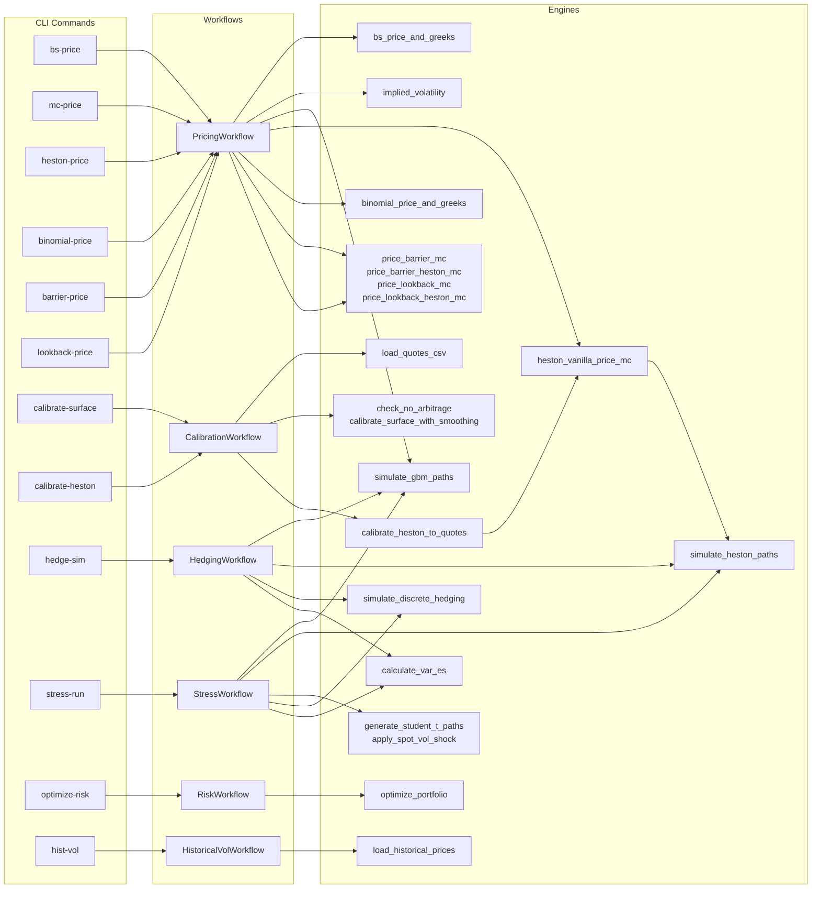
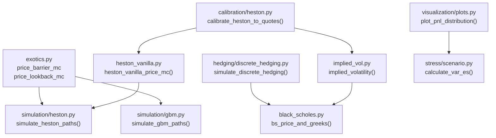
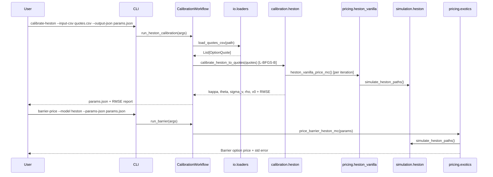
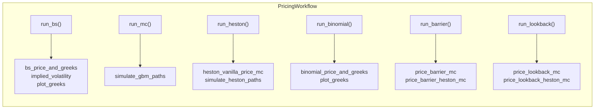
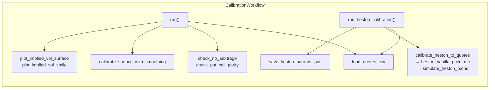
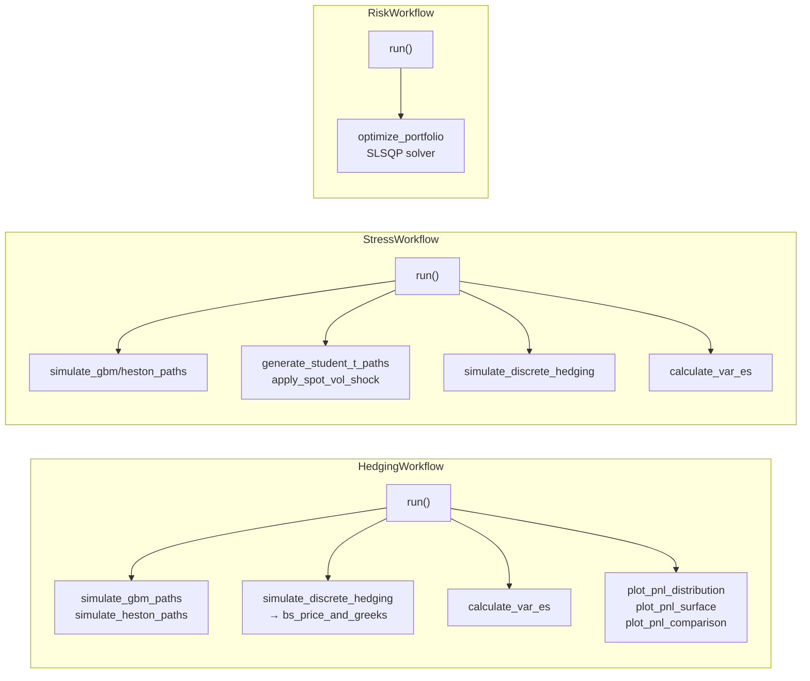
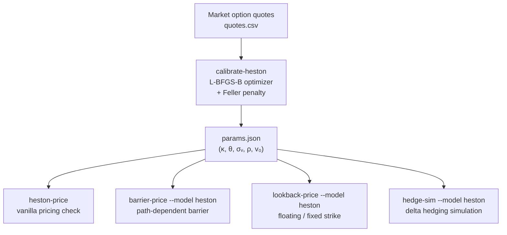

# CLI Reference

The CLI is the primary entry point for the `derivatives-pricing-model` toolkit — a quantitative finance library for derivatives pricing, stochastic volatility simulation, hedging, stress testing, and portfolio risk optimization.

---

## Three-Layer Architecture



---

## Command → Workflow → Engine Map



---

## Engine Internal Dependencies



---

## Data Flow: Market Quotes → Calibration → Exotic Pricing



---

## Pricing Commands



### `bs-price` — Black-Scholes Pricing

Calculates the analytical closed-form price and Greeks (Delta, Gamma, Vega, Theta, Rho, Vanna, Volga) for European options.

**Arguments:** Standard market args + `--target-price` (optional, triggers implied volatility calculation).

**Workflow:** `PricingWorkflow.run_bs()`

```bash
derivatives-pricing-model bs-price --S0 100 --K 100 --T 1.0 --r 0.05 --sigma 0.2
derivatives-pricing-model bs-price --S0 100 --K 100 --T 1.0 --r 0.05 --sigma 0.2 --put
```

---

### `binomial-price` — Binomial Tree (CRR) Pricing

Prices European options using the Cox-Ross-Rubinstein binomial model.

**Arguments:** Standard market args + `--n-steps` (default: 100).

**Workflow:** `PricingWorkflow.run_binomial()`

```bash
derivatives-pricing-model binomial-price --S0 100 --K 100 --T 1.0 --r 0.05 --sigma 0.2 --n-steps 1000
```

---

### `mc-price` — Monte Carlo Pricing (GBM)

Prices European options using Geometric Brownian Motion simulation.

**Arguments:** Standard market args + `--M` (paths, default: 10000), `--n-steps` (default: 252), `--seed`, `--antithetic`.

**Workflow:** `PricingWorkflow.run_mc()`

```bash
derivatives-pricing-model mc-price --S0 100 --K 100 --T 1.0 --r 0.05 --sigma 0.2 --M 10000 --n-steps 252 --seed 42 --antithetic
```

---

### `heston-price` — Heston Stochastic Volatility Pricing

Prices European options under the Heston model via Monte Carlo. Accepts either explicit Heston parameters or a pre-calibrated JSON file.

**Heston model dynamics:**

```
dS = r·S·dt + √V·S·dW₁
dV = κ(θ - V)dt + σᵥ·√V·dW₂
corr(dW₁, dW₂) = ρ
```

**Parameters:** κ (mean reversion speed), θ (long-run variance), σᵥ (vol of vol), ρ (correlation), v₀ (initial variance).

**Arguments:** Standard market args (sigma optional) + Heston args + `--M`, `--n-steps`, `--seed`.

**Workflow:** `PricingWorkflow.run_heston()`

```bash
# With explicit parameters
derivatives-pricing-model heston-price --S0 100 --K 100 --T 1.0 --r 0.05 --M 10000 --n-steps 252 --kappa 2.0 --theta 0.04 --sigma-v 0.30 --rho -0.70 --v0 0.04 --antithetic

# With calibrated parameters from JSON
derivatives-pricing-model heston-price --S0 100 --K 100 --T 1.0 --r 0.03 --M 10000 --n-steps 252 --params-json examples/heston/reference_params.json --antithetic
```

---

### `barrier-price` — Barrier Option Pricing

Prices path-dependent barrier options (Up/Down, In/Out). GBM uses Brownian bridge correction for continuous barrier monitoring; Heston uses discrete path monitoring.

**Arguments:** Standard market args + `--barrier`, `--direction` (up/down), `--barrier-style` (in/out) + `--model` (gbm/heston) + Heston args if applicable.

**Workflow:** `PricingWorkflow.run_barrier()`

```bash
# GBM with Brownian bridge correction
derivatives-pricing-model barrier-price --S0 100 --K 100 --T 1.0 --r 0.05 --sigma 0.2 --barrier 120 --direction up --barrier-style out --M 10000 --n-steps 252 --seed 42 --antithetic

# Heston with calibrated parameters
derivatives-pricing-model barrier-price --model heston --params-json examples/heston/reference_params.json --S0 100 --K 100 --T 1.0 --r 0.03 --barrier 120 --direction up --barrier-style out --M 10000 --n-steps 252 --seed 42
```

---

### `lookback-price` — Lookback Option Pricing

Prices lookback options where the payoff depends on path extrema. Supports fixed-strike and floating-strike under GBM (Brownian bridge extrema correction) and Heston (discrete monitoring).

**Arguments:** Standard market args + `--lookback-style` (fixed/floating) + `--model` (gbm/heston) + Heston args if applicable.

**Workflow:** `PricingWorkflow.run_lookback()`

```bash
# Floating-strike lookback call under Heston
derivatives-pricing-model lookback-price --model heston --params-json examples/heston/reference_params.json --S0 100 --K 100 --T 1.0 --r 0.03 --lookback-style floating --M 10000 --n-steps 252 --seed 42
```

---

## Calibration Commands



### `calibrate-surface` — Implied Volatility Surface

Calibrates an implied volatility surface from market quotes. Performs static no-arbitrage checks (butterfly and calendar spread violations) and produces a smoothed volatility grid.

**Arguments:** `--input-csv`, `--S0`, `--r`.

**Workflow:** `CalibrationWorkflow.run()`

```bash
derivatives-pricing-model calibrate-surface --input-csv quotes.csv --S0 100 --r 0.05
```

---

### `calibrate-heston` — Heston Parameter Fitting

Calibrates the five Heston parameters (κ, θ, σᵥ, ρ, v₀) to vanilla option quotes using **L-BFGS-B** optimization with a soft Feller condition penalty (`2κθ ≥ σᵥ²`). Outputs RMSE on prices and implied volatilities.

**Arguments:** `--input-csv`, `--S0`, `--r` + calibration args + initial guesses (`--init-kappa`, `--init-theta`, `--init-sigma-v`, `--init-rho`, `--init-v0`).

**Workflow:** `CalibrationWorkflow.run_heston_calibration()`

```bash
derivatives-pricing-model calibrate-heston --input-csv examples/heston/synthetic_heston_quotes.csv --S0 100 --r 0.03 --M 4000 --n-steps 64 --maxiter 30 --antithetic --output-json examples/heston/calibrated_params.json
```

---

## Hedging & Risk Commands



### `hedge-sim` — Discrete Delta Hedging Simulation

Simulates discrete-time delta hedging over multiple paths with P&L attribution across theta, gamma, vega, vanna, volga, transaction costs, and residual slippage.

**Arguments:** Standard market args + `--M`, `--n-steps`, `--cost` (proportional transaction cost) + `--model` (gbm/heston) + Heston args if applicable.

**Workflow:** `HedgingWorkflow.run()`

```bash
# GBM
derivatives-pricing-model hedge-sim --S0 100 --K 100 --T 1.0 --r 0.05 --sigma 0.2 --n-steps 252 --M 1000 --cost 0.001 --seed 42

# Heston
derivatives-pricing-model hedge-sim --model heston --S0 100 --K 100 --T 1.0 --r 0.05 --sigma 0.2 --n-steps 252 --M 1000 --cost 0.001 --kappa 2.0 --theta 0.04 --sigma-v 0.30 --rho -0.70 --v0 0.04 --seed 42
```

---

### `stress-run` — Stress Testing

Evaluates portfolio performance under stress scenarios: Gaussian baseline, heavy-tailed (Student-t), and finite spot/vol shocks. Reports VaR and Expected Shortfall.

**Scenarios:**
- **Gaussian**: standard GBM simulation
- **Student-t** (`--df`): fat-tailed returns via `generate_student_t_paths()`
- **Spot/Vol shock** (`--spot-shock`, `--vol-shock`): instantaneous parallel shifts via `apply_spot_vol_shock()`

**Arguments:** Standard market args + `--M`, `--n-steps`, `--df`, `--spot-shock`, `--vol-shock`, `--seed`.

**Workflow:** `StressWorkflow.run()`

```bash
derivatives-pricing-model stress-run --S0 100 --K 100 --T 1.0 --r 0.05 --sigma 0.2 --n-steps 252 --M 1000 --df 4.0 --spot-shock -0.10 --vol-shock 0.05 --seed 42
```

---

### `optimize-risk` — Portfolio Risk Optimization

Optimizes portfolio hedging under linear Greek neutrality constraints and quadratic residual-risk penalties using **SLSQP**.

**Arguments:** `--input-json` (portfolio config with `current_greeks`, `available_instruments`, `factor_covariance`).

**Workflow:** `RiskWorkflow.run()`

```bash
derivatives-pricing-model optimize-risk --input-json examples/risk/portfolio_case.json
```

---

### `hist-vol` — Historical Volatility

Calculates annualized rolling realized volatility from historical price data.

**Arguments:** `--input-csv`, `--window` (rolling window in days, default: 21), `--date-col`, `--price-col`.

**Workflow:** `HistoricalVolWorkflow.run()`

```bash
derivatives-pricing-model hist-vol --input-csv prices.csv --window 21
```

---

## Visualization

All commands that generate plots support two additional flags:

| Flag | Description |
| --- | --- |
| `--save-plots <directory>` | Save all plots as PNG files at 300 DPI in the specified directory |
| `--no-plots` | Suppress all graphical output |

### Available Visualizations

| Command | Plots Generated |
| --- | --- |
| `bs-price` | Greek sensitivity curves (Delta, Gamma, Vega, Theta, Rho, Vanna vs spot), payoff diagram with breakeven |
| `binomial-price` | Greek sensitivity curves, payoff diagram with breakeven |
| `mc-price` | Monte Carlo convergence plot with 95% CI band and BS analytical benchmark |
| `calibrate-surface` | 3D implied volatility surface (cubic interpolation), volatility smile by moneyness per maturity |
| `hedge-sim` | P&L distribution with VaR tail shading, P&L attribution waterfall, hedging path fan chart, P&L vs final spot (binned with CI band), P&L density hexbin, 3D P&L surface, baseline vs stress comparison |
| `stress-run` | Scenario comparison (VaR/ES grouped bar chart across Gaussian, Student-t, spot/vol shock, short convexity) |
| `hist-vol` | Rolling realized volatility with underlying price overlay and high-vol regime shading |

A consolidated multi-page PDF of all plots (using synthetic seeded data) can be generated with:

```bash
PYTHONPATH=src python scripts/generate_visualizations_report.py
# Output: output/visualizations.pdf
```

Example usage of CLI flags:

```bash
derivatives-pricing-model hedge-sim --S0 100 --K 100 --T 1.0 --r 0.05 --sigma 0.2 --n-steps 252 --M 1000 --cost 0.001 --save-plots output/plots
derivatives-pricing-model hedge-sim --S0 100 --K 100 --T 1.0 --r 0.05 --sigma 0.2 --n-steps 252 --M 1000 --cost 0.001 --no-plots
```

---

## End-to-End Pipeline: Calibration → Exotic Pricing



**Step 1 — Calibrate** Heston parameters from vanilla quotes:
```bash
derivatives-pricing-model calibrate-heston --input-csv quotes.csv --S0 100 --r 0.03 --M 4000 --n-steps 64 --maxiter 30 --antithetic --output-json params.json
```

**Step 2 — Price vanillas** with calibrated parameters:
```bash
derivatives-pricing-model heston-price --S0 100 --K 100 --T 1.0 --r 0.03 --params-json params.json --M 50000 --n-steps 252 --antithetic
```

**Step 3 — Price exotics** with the same parameters:
```bash
derivatives-pricing-model barrier-price --model heston --params-json params.json --S0 100 --K 100 --T 1.0 --r 0.03 --barrier 120 --direction up --barrier-style out --M 50000 --n-steps 252

derivatives-pricing-model lookback-price --model heston --params-json params.json --S0 100 --K 100 --T 1.0 --r 0.03 --lookback-style floating --M 50000 --n-steps 252
```

---

## Argument Parsing Infrastructure

The CLI uses shared utility functions in `src/derivatives_pricing_model/cli/parser.py` to inject standard argument groups:

| Utility Function | Purpose | Key Arguments |
| --- | --- | --- |
| `add_standard_market_args` | Standard Black-Scholes inputs | `--S0`, `--K`, `--T`, `--r`, `--sigma`, `--put` |
| `add_heston_args` | Parameters for Heston MC simulation | `--kappa`, `--theta`, `--sigma-v`, `--rho`, `--v0`, `--params-json`, `--antithetic` |
| `add_heston_calibration_args` | Settings for the Heston optimizer | `--M`, `--n-steps`, `--maxiter`, `--weight-mode`, `--output-json` |

---

## Module Reference

### CLI Layer

| Module | Path | Purpose |
|---|---|---|
| `main` | `cli/main.py` | Command dispatcher |
| `parser` | `cli/parser.py` | Shared argument groups |
| `bs_price` | `cli/commands/bs_price.py` | Black-Scholes command |
| `mc_price` | `cli/commands/mc_price.py` | GBM Monte Carlo command |
| `heston_price` | `cli/commands/heston_price.py` | Heston pricing command |
| `binomial_price` | `cli/commands/binomial_price.py` | Binomial tree command |
| `barrier_price` | `cli/commands/barrier_price.py` | Barrier option command |
| `lookback_price` | `cli/commands/lookback_price.py` | Lookback option command |
| `calibrate_surface` | `cli/commands/calibrate_surface.py` | IV surface calibration command |
| `calibrate_heston` | `cli/commands/calibrate_heston.py` | Heston calibration command |
| `hedge_sim` | `cli/commands/hedge_sim.py` | Hedging simulation command |
| `stress_run` | `cli/commands/stress_run.py` | Stress testing command |
| `optimize_risk` | `cli/commands/optimize_risk.py` | Portfolio optimization command |
| `hist_vol` | `cli/commands/hist_vol.py` | Historical volatility command |

### Workflows Layer

| Class | Path | Methods |
|---|---|---|
| `PricingWorkflow` | `workflows/pricing_workflow.py` | `run_bs`, `run_mc`, `run_heston`, `run_binomial`, `run_barrier`, `run_lookback` |
| `CalibrationWorkflow` | `workflows/calibration_workflow.py` | `run`, `run_heston_calibration` |
| `HedgingWorkflow` | `workflows/hedging_workflow.py` | `run` |
| `StressWorkflow` | `workflows/stress_workflow.py` | `run` |
| `RiskWorkflow` | `workflows/risk_workflow.py` | `run` |
| `HistoricalVolWorkflow` | `workflows/historical_vol_workflow.py` | `run` |

### Engines Layer

| Module | Path | Public Functions |
|---|---|---|
| `black_scholes` | `engines/pricing/black_scholes.py` | `bs_price_and_greeks` |
| `binomial` | `engines/pricing/binomial.py` | `binomial_price`, `binomial_price_and_greeks` |
| `heston_vanilla` | `engines/pricing/heston_vanilla.py` | `heston_vanilla_price_mc` |
| `exotics` | `engines/pricing/exotics.py` | `price_barrier_mc`, `price_barrier_heston_mc`, `price_lookback_mc`, `price_lookback_heston_mc` |
| `implied_vol` | `engines/pricing/implied_vol.py` | `implied_volatility` |
| `gbm` | `engines/simulation/gbm.py` | `simulate_gbm_paths`, `simulate_gbm_paths_student_t` |
| `heston` (sim) | `engines/simulation/heston.py` | `simulate_heston_paths`, `check_feller_condition` |
| `surface` | `engines/calibration/surface.py` | `check_no_arbitrage`, `check_put_call_parity`, `calibrate_surface_with_smoothing` |
| `heston` (cal) | `engines/calibration/heston.py` | `calibrate_heston_to_quotes` |
| `discrete_hedging` | `engines/hedging/discrete_hedging.py` | `simulate_discrete_hedging` |
| `scenario` | `engines/stress/scenario.py` | `calculate_var_es`, `generate_student_t_paths`, `apply_spot_vol_shock`, `generate_short_convexity_scenario` |
| `optimization` | `engines/risk/optimization.py` | `optimize_portfolio` |

### Support Layer

| Module | Path | Purpose |
|---|---|---|
| `loaders` | `io/loaders.py` | `load_quotes_csv`, `load_historical_prices` |
| `plots` | `visualization/plots.py` | All `plot_*` functions |
| `validation` | `utils/validation.py` | Input validation helpers |
| `heston_params` | `utils/heston_params.py` | `load_heston_params_json`, `save_heston_params_json` |
| `logging_config` | `utils/logging_config.py` | Logger setup |
| `domain` | `models/domain.py` | `OptionQuote` dataclass |
